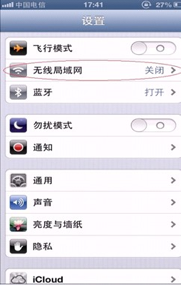
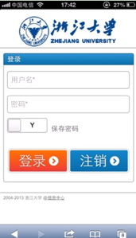

# WiFi无线上网

2013年初，全校范围内基本实现了无线网络覆盖，大大方便了同学们的上网需求。

## 笔记本电脑

1. 打开无线网卡，找到 SSID 为`ZJUWLAN`的 WiFi 网络；
> 请确认已正确安装无线网卡驱动，并已打开无线网卡开关。选择SSID为ZJUWLAN的无线网络，并双击进行连接，无线网卡的地址设为自动获取。

2. 登录浙江大学无线网络；
> 打开浏览器输入任意网址，即可进入认证页面，无线网帐号无需另行申请（用户名和密码即为校网`VPN`用户名密码）。

**注意：**_部分浏览器由于安全设置问题会导致认证页面无法正常弹出，这时将浏览器跳转地址https://中的字母s删掉后回车，即可正常显示认证页面_

**温馨提示：**

**使用电脑上网时，不可同时连接有线网络和无线网络，若插网线使用有线网络，请将无线网络断开；若使用无线网络，请将网线拔出，否则可能造成拨号错误。**

## 移动终端

### 苹果产品（以iPhone手机为例）

1. 点击**设置**图标进入设置，打开无线局域网（WiFi），iPhone开始自动搜索周围WIFI网络；  

    

2. 选择`ZJUWLAN`后，点击浏览器，打开任意网页，会出现无线网络认证界面，提示您输入用户名和密码。登录成功后即可上网。

    
    
 

### Android手机设置无线

1. 点击桌面上的**设置**图标进入设置打开WLAN，手机开始自动搜索周围的WIFI网络；
2. 搜索ZJUWLAN并点击浏览器上网，会提示输入用户名和密码； 
3. 登录成功后，在ZJUWLAN下面会显示“已连接”，就可以上网浏览了。
