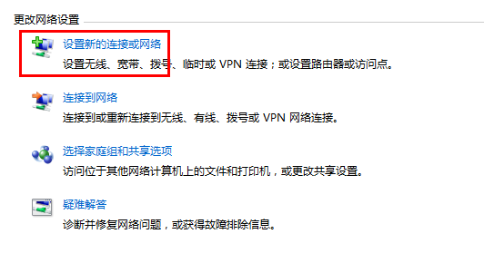
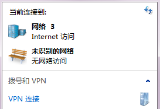

# Win7 下如何登录 VPN

在申请好 `VPN` 帐号之后，就可以打开电脑登录浏览网页了。本文以 Windows7 为例，说明如何设置 `VPN`。

点击桌面右下方的网络连接图标，如下图：

在打开的窗口中，点击“设置新的连接或网络。

输入服务器地址：`lns.zju.edu.cn`

**注意：**可选的地址还有 `10.5.1.7`，`10.5.1.5`，`10.5.1.9`，如果发现网络不好，换个试试吧！

用户名密码就是你申请的 `VPN` 帐号了，新生都默认有一个帐号，用户名为*学号*，密码为*身份证后六位*

这时，再点开桌面右下角的网络图标，发现多了一个 `VPN连接`

先不急着连接，右键==>属性。选择安全选项卡，VPN类型设置为 `L2TP`，数据加密设置为 `可选加密`，然后连接应该就可以正常上网了！

**Enjoy!**

