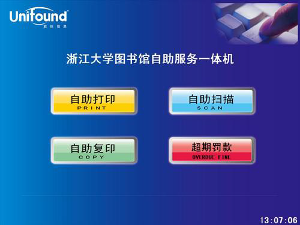

# 图书馆使用指南

大学的图书馆永远都是一个资源宝库，学会如何更好的使用图书馆将会给你的大学学习生活提供更多的便利。

## 基础服务：

- 借还书、阅览、咨询：在紫金港基础图书馆里，三层提供了 30 多万册的图书可以阅览。暖暖秋日，捧一本喜爱的书在图书馆的一角静静地坐上一下午，细细的品味个中乐趣。图书馆提供的外借服务还可以让读者将自己喜爱的图书借回细细品味（本科生最多可以一次性借阅 12 本书哦）。基础分馆在门厅和读者服务大厅设有咨询台，提供图书馆相关问题咨询。每个阅览室也设有咨询台，提供该阅览室文献相关内容的咨询。这些咨询服务使得大家可以在图书馆可以更好的利用图书馆资源。图书馆的资源丰富，更多的资源还是需要大家自己不断地发掘的。

- 电子阅览和视听服务：基础分馆设有电子阅览室和视听阅览室。二楼的视听提供了海量的影视资源，还提供了有线电视服务。三楼的电子阅览室近 200 台电脑可以为大家提供足够的资源来进修文献询，阅读文献等信息化服务。
 
## 如何更好的服务：
 
- 文献传递：图书馆的文献传递服务为校内外读者提供本馆的全文文献复印服务；国内外的图书情报机构复印、传递期刊论文、会议文献、学位论文、标准、专利、技术报告等文献资料；  为本校师生借阅国家图书馆收藏的三年前编目的外文普通图书和中文复本图书。这样你就可以在浙大就看到其他图书馆的藏书。
- 馆间互借：读者只要通过图书馆“分馆互借”系统提交请求，图书馆在收到请求后会将图书送到所提交的取书馆(紫金港校区的基础馆和医学馆之间不提供互借服务)。
- 检索服务：在图书馆的网站上个人信息查询中可以检索图书馆中图书，通过检索服务就可以快速的找到想要的书了。
- 咨询服务：图书馆会不定期的举办各种讲座课程，介绍如何更好的检索不同专业的论文。并且会在讲座之后将讲座的资料放到网上。
- 通知服务：手机短信通知，邮件通知，新到期刊邮件通知提供给读者更加方便的服务。免费开通了以后就不用担心一不小心借的图书过期了，也不用担预约的图书没有及时拿到。

## 自助服务

- 自主借书：图书馆的工作人员下班后也可以借书的哦。图书馆的自助借书仪上全天提供自主借书服务，利用个人校园卡可以畅游借书

- 自主复印、自助打印、自主扫描：校园自助打印真正实现打印无人化管理。全校师生可在校园内任意一台装有打印客户端的机器上进行打印，并在任意一台自助打印复印一体机上，方便地用校园卡进行自助刷卡缴费，并取走所打印的文档。
