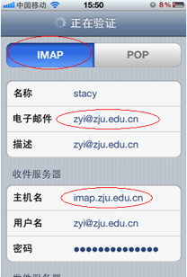
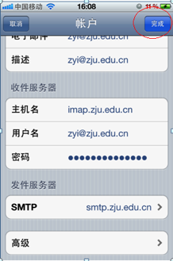

# 手机中使用zju邮箱账号

* POP3协议服务器地址及端口号： 

    接收邮件服务器：pop3.zju.edu.cn 端口：110  （使用SSL端口：995）

    发送邮件服务器：smtp.zju.edu.cn 端口：25   （使用SSL端口：994） 

* IMAP协议服务器地址及端口号： 

    接收邮件服务器：imap.zju.edu.cn 端口：143  （使用SSL端口：993）

    发送邮件服务器：smtp.zju.edu.cn 端口：25   （使用SSL端口：994） 

（下面介绍pop和imap 协议下不使用ssl的操作方法）

## imap协议下建立zju邮箱账号

第一步：点击“设置”

第二步：如下图，点击“邮件、通讯录、日历”

第三步：如下图，点击“添加账户”

第四步：如下图，点击“其他”

第五步：如下图，点击“添加邮件账户”

第六步：如下图，填写邮箱地址和密码后点击下一步

第七步：如下图，选择imap，填写收信服务器地址：imap.zju.edu.cn和发信服务器地址：smtp.zju.edu.cn后点击“下一步”

第八步：如果跳出如下对话框，点击“是”

第九步：如下图，点击“存储”

第十步：如下图，点击已经添加好的账号

第十一步：如下图，点击“账户”

第十二步：如下图，点击“发信服务器”

第十三步：如下图，确认imap发信服务器端口是25，关闭ssl，点击“完成”

第十四步：如下图，点击“高级”

第十五步：如下图，确认imap收信服务器端口是143，关闭ssl，点击“账户”返回上一页

第十六步：如下图，点击“完成”就建立好了，您可以在mail里面收发邮件了。

