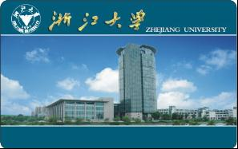
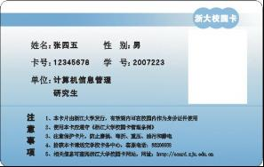
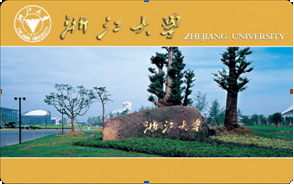
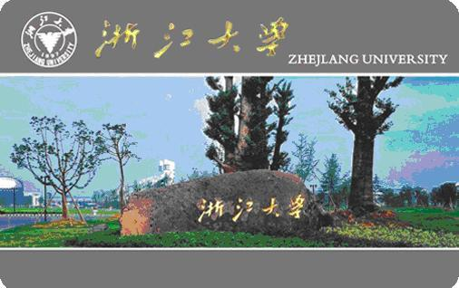
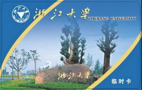

# 校园卡具备的功能

校内身份证件功能：学生证、工作证、退休证。

校内电子证件功能：借书证、住宿证、上机卡、门禁卡、签到卡、考勤卡等。

校内消费功能：就餐、购物、上机、上网、水控、乘车、罚款、拍照、复印、打印、报销、网上交易等。

## 校园卡集成帐户

目前校园卡内集成了两种帐户信息：

卡帐户，相当于校内电子钱包：用于就餐、购物、洗澡、乘车、自助缴费、自助转账等，需在自助终端或读卡器上刷卡使用。

电子账户：实现网上银行转账、网上缴网络费、网上缴考试报名费，网上交易支付等无卡交易。

## 校园卡分类

根据校园人员类型及服务要求把校园卡分为**正式卡**、**消费卡**、**功能卡**、**临时卡**四类。

### 一、正式卡为记名卡，在校园内可替代工作证或学生证使用，具有借书证、门禁卡、会议考勤、缴费、经费卡报账等功能，限本人使用。

发放范围：人事处备案的在编教职工；在册的国家计划内招收的全日制学生。

发放原则：一人一卡，申领首张正式卡免收工本费。

发放流程：教职工在办理报到（或退休）手续后凭校人事处出具的报到通知单到紫金港校园卡服务部办理。学生正式卡由学校统一组织发放（本科生随通知书寄发；研究生开学报到后在学院领取；本硕博连读生取得新学号后由学院统一申请换卡）。        

### 二、功能卡为记名卡，不得转借及转让。具有消费、缴费、门禁、借书、经费卡报账等功能。

发行范围：参加继续教育、短期进修等国家计划外在校学习的非全日制各类学生及进修人员；各部门自招人员等在校园内的为师生提供服务的人员。

发放原则：一人一卡，办卡收取卡工本费。有效期：合同期

发放流程：由院处级（用人/办学）单位统一递交办卡申请表至校园卡服务部。申请办理功能卡的人员须已在“浙江大学统一身份认证系统”中注册并审核通过。

### 三、消费卡为记名卡，具有消费、门禁功能、图书借阅、经费卡报账等功能。

发行范围：校外人员。

办卡原则：一人一卡，办卡收取工本费。有效期：一年。

发放办法：携带本人身份证到校园卡服务部办理。

### 四、临时卡，仅有临时消费功能。

发行范围：所有人员。

发放原则：收取工本费押金。遗失卡片无法挂失、补卡。有效期3个月。

发放流程：到校园卡服务部、各食堂充值点现场办理。