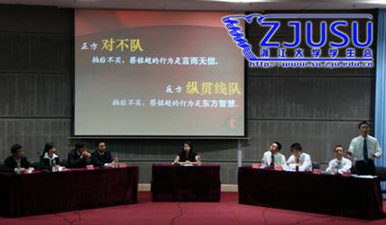
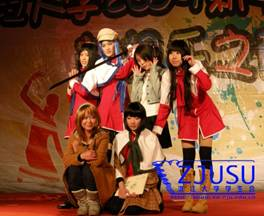
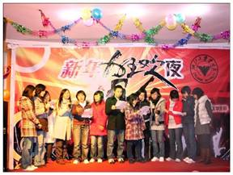
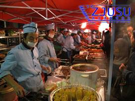
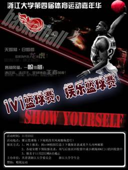
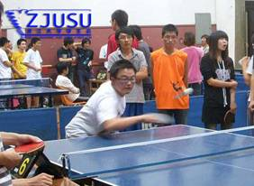
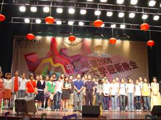
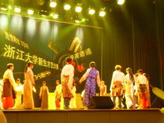

# 浙江大学学生会

## 简介 ##

- **我们的组织：**浙江大学学生会是浙江大学学生的群众性组织，在校党委的直接领导和校团委的具体指导下，依靠全校学生开展工作。

- **我们的宗旨：**以马列主义、毛泽东思想、邓小平理论和“三个代表”重要思想为行动指南，贯彻落实科学发展观，全心全意为全体学生服务，代表广大学生利益，反映学生意愿，沟通学校领导及各部门与学生的联系，参与学校民主管理，创造和谐校园环境，为学校创建世界一流大学贡献青春才智。

- **我们的追求：**和谐、诚信、民主、创新

### 特色活动
1. 求是辩论赛

	为巩固和创新校园文化活动品牌，培养全面发展的高素质人才，浙江大学学生会与团委、教务部联合发起了浙江大学学生科技文化节活动。科技文化节内容丰富多彩,其中以“求是杯”辩论赛最具代表性，它展示了浙大学子的智慧和才情、激情与冷静。“求是杯”辩论赛兴起于1990年，成为浙江大学最高水平、最高规格的辩论赛事，“求是杯”从1993年起，在浙大成为一年一度的校级文化盛事。

	

2. 新年狂欢夜晚会

	新年狂欢夜晚会是浙江大学的传统性节目，是浙江大学新年文化盛宴当中不可缺少的一部分。

	辞旧迎新，没有家人陪在身边，大多数学子在此刻都是孤独的。每逢佳节倍思亲，冬天凛冽的寒风更加深了学子们浓浓的乡愁。新年狂欢夜晚会给全体学子提供了一个欢聚一堂、情感交流的空间。晚会体现了当代大学生青春活力的精神风貌，贯穿了时尚流行元素，展现出了当代大学生的巨大创造力，它用回顾的方式在激情中迎接新年的到来，同时对于这台晚会，学生会在继承狂欢夜传统的基础上，每年都努力创新，给大家带来更多的惊喜和感动。这不仅是一次激情燃烧的盛会，更是我们温情凝聚的时刻。

	

3. 美食节系列活动

	“民以食为天”，在拥有五千年悠久历史的文明古国，“食”文化成为其中不可或缺的一部分。“浙江大学美食文化节”便是吸纳了五湖四海别具特色的美食及美食文化。浙江大学美食节已成为了浙大师生期盼的美食文化盛典，旨在加强学校后勤部门与师生间的沟通交流，提高后勤部门的服务水平，为师生们奉上美味的盛宴。更是以美食为平台，促进留学生与中国学生之间不同文化的交流。

	

4. 学生活动嘉年华

	体育，是一种力量的竞技，是一种精神的搏杀，同时也是一种文化。年轻人对体育运动的渴望和热爱凝聚在一起，便成为赛场上飞扬的激情，无限的活力。怀着一颗“运动”的心，求是学子每年都有属于自己的体育盛事——“浙江大学学生趣味运动嘉年华”。运动嘉年华包括：培养团队合作精神，“团结就是力量”拔河比赛；体现国球魅力的乒乓球争霸赛的华家池四院乒乓球争霸赛; 尽展飒爽英姿的“谁羽争锋”羽毛球大赛；燃烧激情将嘉年华推向高潮的篮球盛宴之3v3篮球赛。

	
 
5. 迎新生晚会

	为增加新生对浙江大学的文化的了解，感受浙江大学的风采，尽快融入浙江大学的生活，迎新文艺晚会成为浙江大学的一项传统。迎新文艺晚会的节目丰富多彩，有新生的表演，有老生的献艺；有社团节目，有个性展示；每年都有创新。晚会上校领导和老师的亲切讲话，也给新生们很多启迪，精彩的表演还拉近了新生之间的距离，新生与新环境的距离。

	

## 其他品牌活动

- 一二九大合唱
- 校园歌手大赛
- 毕业生晚会  
- 学生文艺晚会
- “三育人”标兵颁奖晚会
- 赴江西泰和暑期社会实践
- 沪港澳访问