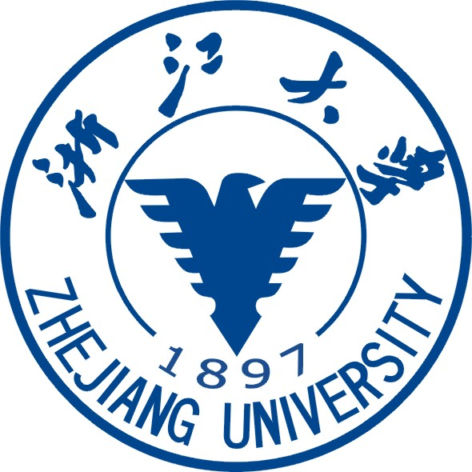
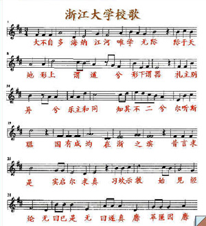
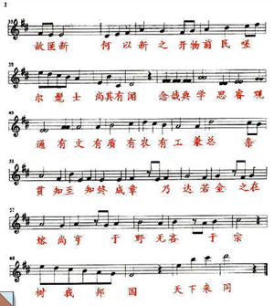
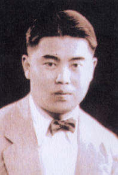
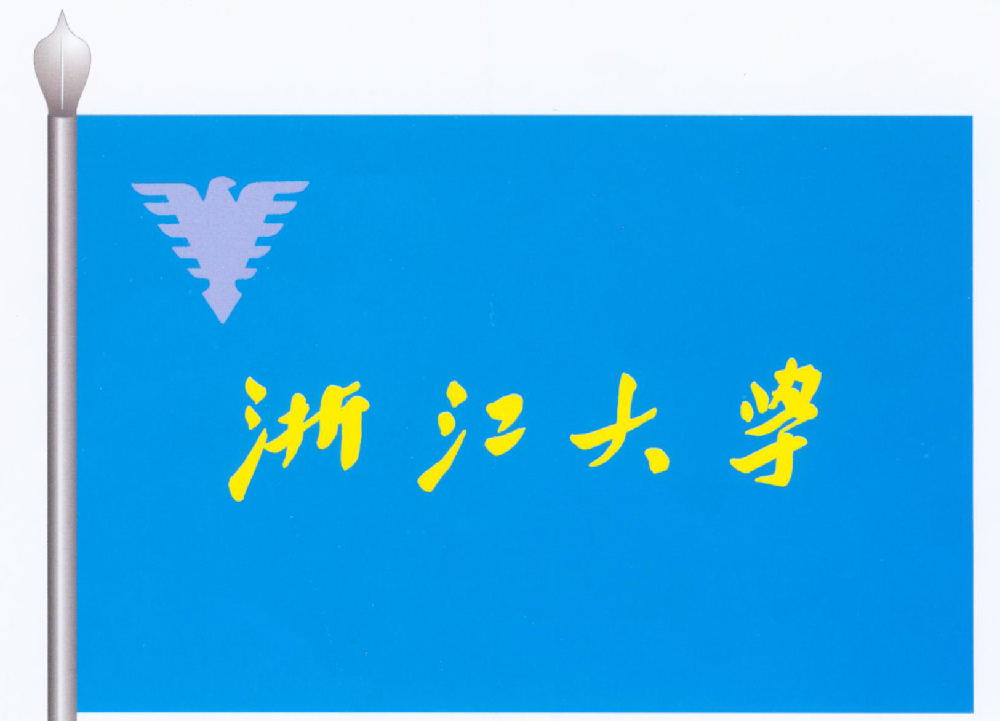
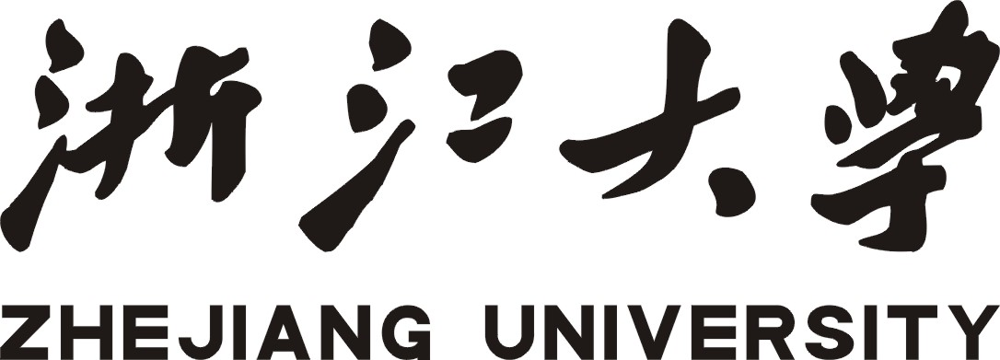

# 浙江大学概况

浙江大学是一所历史悠久、声誉卓著的高等学府，坐落于中国历史文化名城、风景旅游胜地杭州。浙江大学的前身求是书院创立于1897年，为中国人自己最早创办的新式高等学校之一。1928年，定名国立浙江大学。抗战期间，浙大举校西迁，在贵州遵义、湄潭等地办学七年，1946年秋回迁杭州。1952年全国高等学校院系调整时，浙江大学部分系科转入兄弟高校和中国科学院，留在杭州的主体部分被分为多所单科性院校，后分别发展为原浙江大学、杭州大学、浙江农业大学和浙江医科大学。1998年，同根同源的四校实现合并，组建了新浙江大学，迈上了创建世界一流大学的新征程。在115年的办学历程中，浙江大学始终以造就卓越人才、推动科技进步、服务社会发展、弘扬先进文化为己任，逐渐形成了以“求是创新”为校训的优良传统。

浙江大学是一所特色鲜明、在海内外有较大影响的综合型、研究型大学，其学科涵盖哲学、经济学、法学、教育学、文学、历史学、艺术学、理学、工学、农学、医学、管理学等十二个门类。学校设有7个学部，37个学院（系）。拥有一级学科国家重点学科14个，二级学科国家重点学科21个。在ESI全部22个学科中，浙江大学有14个学科进入世界前1%，其中7个学科进入世界学术机构前100位。

浙江大学坚持“以人为本，整合培养，求是创新，追求卓越”的教育理念，打造卓越教育品牌，致力于培养具有国际视野的未来领导者。在长期的办学过程中，浙江大学培养了大批杰出人才，校友中当选为两院院士的有160余人。学校与时俱进的教育思想，引领浙大教育教学模式改革始终走在全国高校前列；丰富的校园文化、先进的教学设施和广泛的国际交流为学生成长创造了优越条件。2012年，本科毕业生海内外深造率达到55.16%。

浙江大学注重精研学术和科技创新，建设了一批开放性、国际化的高端学术平台，汇聚了各学科的学者大师和高水平研究团队。近年来，发表权威学术期刊论文、获授权国家发明专利等主要科研指标保持全国高校领先地位，在科学技术和人文社科领域取得了许多重要成果。学校主动对接国家和区域战略需求，着力打造具有影响力的高水平创新源、人才泵和思想库。2012年，科研到款经费达到30.78亿元，其中超过千万元的在研项目达到107项。

截止2013年9月30日，浙江大学现有全日制在校学生46045人，其中：硕士研究生13949人，博士研究生8658人，本科生23438人；另有外国留学生3489人。有专任教师3302人，其中教授及其他正高职人员1497人，教师中有中国科学院院士13人、中国工程院院士14人、国家“千人计划”学者52人、“973计划”项目首席科学家29人、“长江计划”特聘（讲座）教授89人、国家杰出青年科学基金获得者93人。学校拥有紫金港、玉泉、西溪、华家池、之江等5个校区，占地面积4.50平方公里，校舍总建筑面积2072303平方米，另有在建工程面积263053平方米。图书馆总藏书量658万余册，建有7家高水平附属医院。

“国有成均，在浙之滨”。今天的浙江大学，正努力建设世界一流的综合型、研究型、创新型大学。学校将秉承求是创新精神，致力于创造与传播知识、弘扬与传承文明、服务与引领社会，积极推动国家繁荣、社会发展和人类进步。

## 学校标识

### 校徽

1990年12月15日学校在浙江大学校报上公布了浙江大学校标设计稿的二个方案。根据校领导的意见，校长办公室同时委托工会和团委，发放了1200份印有两个方案的选票，分别征求教职工和学生的意见。通过比较，大多数师生员工倾向于方案一，即以传统的"求是鹰"为主体所构成的校标设计稿。认为表现刚健、博击个性的"求是鹰"已作为浙大的象征，并在广大师生员工和校友中留下了深刻的印象。因而，保留二三十年代浙大校徽中求是鹰的基本形状，在一定程度上也体现了历史的继承性。同时有些专家认为，通过对传统"求是鹰"图形结构的简化，强化了求是鹰形象的气质特征，这也是有意识的再创造的典型化过程，但腾飞的气势刻划得还不够。

校长办公室汇集了有关意见后，向校长作了汇报。在1991年1月22日举行了校务会议上，学校党政领导对校标方案作了审议，认为二个校标设计方案在设计思想和表现形式上各具特色；同时肯定了方案二在形式上有一定新意。经过讨论，校务会议基本确定方案一作为校标，提出对求是鹰图案应再作适当修改，并略放大些，英文校名采用黑体。据此，校长办公室在方案一的基础上重新作了调整和绘制。1991年1月31日的校务会议再次审议了修改后的校标。这样，校标获得正式通过。

校标，是学校的象征。可应用于学校重要活动场合、有关宣传媒介、信笺、信封等。

### 校训

> #求是、创新

浙江大学老校训——“求是”的渊源可以追溯至浙大的前身求是书院。

求是书院自创建之日起，就提倡“务求实学，存是去非”。并在师生中逐渐形成了“正其谊、不谋其利，明其道、不计其功”、“以尽一已职责”的“求是”校风，这种校风一直延续到以后的浙江大学。

抗战期间，浙江大学西迁流亡办学，艰难困苦和生死别离，使竺可桢校长对“求是”有了更深刻的理解。

1938年11月1日，竺可桢在广西宜山的开学典礼上，作了《王阳明与大学生的典范》的演讲。在演讲中，他以王阳明的求是精神、遇险不畏精神、艰苦卓绝精神和公忠报国精神，激励浙大师生在艰危中奋发进取，并提出要以 “求是”两字为校训，以便更好地继承和发扬“求是”的优良传统，贯彻治学的精义。

1938年11月19日，校务会议正式通过了竺可桢的这项提议。

关于“求是”的涵义，竺可桢曾作过多次阐述，他在《求是精神与牺牲精神》的演讲中说：“所谓求是，不仅限为埋头读书或是实验室做实验。求是的路径，中庸说得最好，就是‘博学之、审问之、慎思之、明辨之、笃行之。’单是博学审问还不够，必须审思熟虑，自出心裁，独著只眼，来研辨是非得失。既能把是非得失了然于心，然后尽吾力以行之，诸葛武侯所谓‘鞠躬尽瘁，死而后已’，成败利钝，非所逆睹。”最好的例子就是科学史上布鲁诺、伽利略、刻卜勒、牛顿、达尔文、赫胥黎等人“排万难冒百死以求真知”的行为。中国也有不少具有求是精神的先贤，孙中山先生就是其中的一位。孙中山先生不但鼓吹革命而且实行革命，这革命精神，正是源于求是的精神。

在此，竺可桢已经将“求是”的涵义大大地拓广和深化了，他所倡导的求是精神就是科学精神、牺牲精神、革命精神、奋斗精神和开拓创新精神。

继后，竺可桢又在《科学之方法与精神》一文中更明确地阐述了“求是”的方法和路径，他说：“近代科学的目标是什么？就是探求真理。科学方法可以随时随地而改换，这科学目标，蕲求真理也就是科学的精神，是永远不改变的。……据吾人的理想，科学家应取的态度应该是：(1)不盲从，不附和，一以理智为依归。如遇横逆之境遇，但不屈不挠，不畏强御，只问是非，不计利害。(2)虚怀若谷，不武断，不蛮横。(3)专心一致，实事求是，不作无病之呻吟，严谨整饬毫不苟且。”

竺可桢的这些论述，特别是他所概括的科学家应取的三种态度，不仅为万千“求是”学子所遵循，而且一直为科学家们所称颂。

新中国成立以来，特别是在改革开放以来，浙江大学的历任领导人，在继承和发扬求是精神的基础上，特别强调在新的历史条件下的开拓创新精神。自那以后，浙江大学逐渐形成了“实事求是，严谨踏实，奋发进取，开拓创新”的优良校风。
1988年5月5日，由路甬祥校长主持的校务会议决定以“求是创新”为新时期浙江大学校训。这是浙江大学为了适应迅猛发展的现代科技和社会需求做出的正确决策，是对求是精神的发扬光大。

路甬祥1992年在建校95周年的致词中说：“创新(即创造)精神，严格地说，它已包含在求是精神之中，……但人们往往把求是理解为求实，侧重于对现有知识的认识和运用，对现状的客观分析和把握，而不特别强调创造与创新……。创新，正是历史上许多杰出的科学家和杰出人才的共同特点。浙江大学要办得有中国特色和自身特点，培养一大批具有献身、求实、创新、协作精神的社会主义建设人才和接班人，必须十分重视创新精神的提倡，并且形成良好的群体意识，坚持正确的社会主义方向和原则，坚持开放，改革创新。创新，是时代的要求，也是科技和教育发展的规律。要使我们学校同步于时代，并不断地取得进步和发展，必须在继承和发扬求是精神的基础上强调创造力的开发，强调培植求是创新精神。”

路甬祥的这段话，既是对为何要立“求是创新”为校训的解答，也是对“求是创新”的诠释。

潘云鹤在1995年浙江大学教学工作会议作的题为《抓住时机，迎接挑战，迈向一流》的讲话中，提出了知识(Knowledge)、能力(Ability)、素质(Quality)并重的人才培养新模式，使得“求是创新”的方法和路径更为具体、明确。潘校长这里所说的知识，包括专业知识、交叉知识；能力包括表达能力、外语能力、计算机能力、创新能力、写作能力、组织能力、想象能力、动手能力等等；素质包括思想素质、道德素质和文化素质。

“求是创新”是新时期求是学子的行为准则和奋斗目标。

正可谓：“求是”源远流长，“求是创新”前程似锦！

### 校歌

> #大不自多     海纳江河

**校歌歌词**

        大不自多     海纳江河         惟学无际     际于天地
        形上谓道兮   形下谓器         礼主别异兮  乐主和同
        知其不二兮   尔听斯聪
        国有成均     在浙之滨         昔言求是     实启尔求真
        习坎示教     始见经纶         无曰已是     无曰遂真
        靡革匪因     靡故匪新         何以新之     开物前民
        嗟尔髦士     尚其有闻
        念哉典学     思睿观通         有文有质     有农有工
        兼总条贯     知至知终         成章乃达     若金之在熔
        尚亨于野     无吝于宗         树我邦国     天下来同 

**校歌译文**

        大海浩瀚而不自满，所以能容纳千江万河。
        大学学问广阔无际，延伸到整个宇宙天地。
        超越形体的称为道，有具体形貌的称为器。
        礼制区别人们差异，音乐使民众和谐相处。
        明白它们的统一关系，就会更加聪慧明智。

        有一所国立大学，在中国东南的浙水之滨。
        它以求是为宗旨，其实就是启迪大家求真。
        学校教育循序渐进，方能培育出治国才俊。
        莫言已把握事物本质，更莫言已穷尽真理。
        没有变革不需因袭，没有旧事物不需更新。
        怎样改革创新？探究事物，做大众的先导。 
        诸位年轻的英才，应当明了这些重要道理。

        要专注于学业，力求思想深刻、识解通明。
        我们有人文、科学、农业、技术多种学科。
        要融会贯通，掌握知识的源流和实践运用。
        日后成才成功，犹如真金经过熔炉的冶炼。 
        要胸襟宽广，不偏守门户之见、宗派之私。
        努力振兴祖国，使世界各国人民和谐共处。
 
**校歌历史**

1938年11月19日，在广西宜山，竺可桢校长主持校务会议，会议决定以“求是”为浙江大学校训，并决定请著名国学家马一浮写校歌歌词。 马一浮作的这首歌词，因为引用了较多的古典，用的是文言文，不太通俗，且读起来有时比较拗口，竺校长曾考虑改写，但他又觉得，马老作的歌词虽文理艰深，但含义深远，很能体现浙江大学所追求的求是精神，因此，这首“大不自多”歌仍请著名作曲家、当时的国立中央音乐学院的应尚能教授谱曲，并经校务会议通过，正式定为浙江大学校歌。

1992年4月浙大95周年校庆期间，曾任宁波大学校长的浙大土木系44届毕业生朱兆祥（前浙大合唱团团长）和浙大外文系46届毕业生邓爽，应浙大合唱团老团员的建议，把校歌歌词逐句对应式地译成白话文，以便阅读。

**校歌内容**

校歌分三章，或曰三段。第一章讲的是国立大学的精神。在旧中国，大学大体有三类:一类是国立大学，即全由国家财政出钱办的，如清华、北大、中央大学、浙大、交大等；一类是教会办的，如燕京，金陵，圣约翰、华西等；还有一类基本以私人为主办的，如南开、暨南等。那么，国立大学的精神是什么？就是它的综合性、就是“海纳江河”。它不同于专科学校，应当各种学科兼收并蓄。在这样的大学里，学科繁多，但不外形而上学(即理论科学)和形而下（谓器），就是讲求实际的应用科学。在这样的大学里，礼制 (即制度)是需要的，因为它将规范学校各方面的活动，比如教学，科研，考试，生活管理等，但同时也需要乐、乐主和同，这里意味着大学内部的各方面又需要和谐，领导与被领导之间，师生之间、同事之间、同学之间都如此，只有和谐才能调动人的主动积极性，产生合力。因此理论与实践，原则和应用，礼与乐，秩序与和谐，你要知道它们不是两种事物，而是一个事物的两个方面，这样，你的所见所闻才会全面，人才会变得聪明。

第二章说明国立浙江大学的精神，发挥校训“求是”二字之真谛。

成均古代表示大学，这里是说，浙江有所大学过去叫求是书院。所谓“求是”实际即启发你去追求真理。人只有求真，才能善，才能美。习坎从易经中来，代表水。水之美德为渐、为默、为恒。古诗日：“唯见长江天际流”，又有“江河万古流”。大家设想一下，一般情况下，江水是否默默地、不间断地永远朝东流去，这里启示我们为学要踏踏实实、循序渐进、坚持不懈地努力，只有这样，才能真正成为经纶天下之才。“无曰已是”四句是校训“ 求是”的真讳，即别认为已很正确，已经找到真理，而要不断去追求，即无曰遂真，而要求真。“靡革匪因”二句说明任何事物都需要不断革新，不要因循守旧，而革新又需要继承(因袭)，这里实际有创新的意思。那么，如何能创新呢?就要不断揭示事物的本质、奥秘。这样，才能与时俱进，不断创新，也才能真正走在群众的前面。这里浙大的精神就是要求是，要创新，要循序渐进，锲而不舍。

第三章讲的是浙大的使命。使命是什么？就是培养优秀的学生。这样的学生在校时应该坚持不懈地努力学习，所谓念哉典学，理念“使命”就是学习，但不是死读书，要学会深入思考，要思想深刻，能洞察事物的本质。学问是多方面的，我校有文理工农医……不要把自己局限在一个局部，要兼总条贯，即要融会贯通各方面的知识，比如学理工的学点文、艺，学文法的学点科技知识。但又要知至知终，知道自己的根本目的，不能样样涉猎，样样不精。当行则行，当止则止，即有所为有所不为。只有这样，才能若金之在熔，即经过锻炼，成章乃达，完成漂亮的文章，当然这里意指成才。但这样的人出校后，你要求发展还要立足于群众之中，所谓尚亨于野，而且要有广阔的胸怀，不要去搞小宗派，只谋一己之利。也只有这样的人材才能建设好国家，让世界来认同。

### 校旗

浙江大学校旗面为矩形，长、宽比为1:1.5，分为6个系列，旗面尺寸（单位厘米）分别为288×192、240×160、192×128、144×96、96×64、66×44；旗面正中为"浙江大学"四字，左上角为求是鹰标志；旗面海兰色底，求是鹰标志为浅兰色，字纯黄色。

各学院院旗可参照校旗制定，在"浙江大学"四字正下方标学院名称，旗色、字色、标志色可自定。

### 校名

### 校庆

浙江大学校庆日为每年5月21日，根据浙江大学前身求是书院首次开学时间为清光绪二十三年四月二十日（公历1897年5月21日）设立。