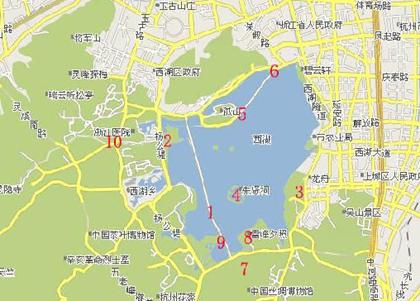

# 游在杭州

俗话说，“上有天堂，下有苏杭”。我们有幸在杭州这个美丽的旅游城市生活学习，那就抓紧时机，在春夏秋冬风景各异的杭州城享受美好的青春吧。

|公园景点名称|票价（元/人次）|公园景点名称|票价（元/人次）|
|:|:|:|:|
|灵隐飞来峰|35（公园卡通用）|六和塔|20（公园卡通用）|
|岳庙|25（公园卡通用）|植物园|10（公园卡通用）|
|黄龙洞|15.00（公园卡补差4元）|胡雪岩故居|20.00（公园卡补差5元）|
|三潭印月(西湖游船)|45 （公园卡不通用）|动物园|15（公园卡通用）|
|虎跑公园|15（公园卡通用）|西溪湿地|80（公园卡补差10元）|
|雷峰夕照|40（公园卡不通用）|北高峰（索道）|上30元，下20元，来回联票40元|

**附：** 

*公园卡说明：*

1. 公园年票在有效使用期限和我局所属公园使用范围内，只需刷卡或亮卡即可进入公园，不受使用次数的限制。
2. 公园卡发售时间：2008年11月15日-2009年10月31日，8：30～16：30，双休日照常办理。
3. **办理方法：**持个人有效身份证及学生证办理；办理新卡者需随带本人1寸免冠近期证件照1张（如果有第二代身份证可不用另带照片，那边可直接扫描）。

	**公园卡办理地点：**南山路61号学士公园罗马广场南侧(浙江省军区对面)。发售处电话：`0571-87065409` 。

## “西湖十景”地图介绍： ##

1. 苏堤春晓（Spring Dawn at Su Causeway）
1. 曲苑风荷（Lotus in the Breeze at Crooked Courtyard）
1. 柳浪闻莺（Orioles singing in the willows）
1. 三潭印月（Three pools mirroring the moon）
1. 平湖秋月（Autumn Moon over the Calm Lake）
1. 断桥残雪（Melting Snow at Broken Bridge）
1. 南屏晚钟（Evening bell at Nanping hill）
1. 雷峯夕照（Sunset glow at Leifeng pagoda）
1. 花港观鱼（Viewing Fish at flower harbor）
1. 双峰插云（Twin peaks piercing Clouds）

## 交通路线： ##

- K74——>大塘新村——>6路——>岳庙或曲院风荷（苏堤北端）
- K89——>浙大附中——>Y4——>岳庙或曲院风荷（苏堤北端）

## 免费景点推荐： ##

- **太子湾**（09年开始免费开放，每个季节都有不同的精致，风景宜人）
- **九溪烟树**（俗称“九溪十八涧”。每遇湿度大的天气均会产生“烟树”的景致。杭城的避暑胜地。）
- **吴山天风**（吴山不高，但由于插入市区其东、北、西北多俯临街市巷陌，南面可远眺钱塘江及两岸平畴，上吴山仍有凌空超越之感，且可尽揽杭州江、山、湖、城之胜。山脚下还有清 河坊街。）
- **河坊街**（74 骆家庄下车转 25 吴山广场下车）：古色古香的建筑，各种各样的小吃，老字号的店铺，民间艺人的绝活表演
- **宝石流霞**（西湖三面云中，葛岭、宝石山自成一体，景色奇特。它们的山体均由侏罗系凝灰岩构成，其中最多见的是熔结凝灰岩。这里的山岩呈赭红色，岩体中有许多闪闪发亮的红色小石子，每当阳光映照，满山流韦纷披，尤其是朝阳或落日红 光洒沐之时，分外耀目， 仿佛数不清的宝石在断断生辉。宝石山正因此而得名。）
- **杭州历史博物馆**（01年10月8日正式对外开馆，是杭州市首家综合性展示城市整体历史文化和乡土风貌的大型博物馆）
- **杭州大剧院**（机动车管辆管理所坐B2直达）：经常有各种精彩的演唱会、音乐会、歌剧舞剧上演，是爱好艺术的同学的好去处。隔壁就是新建的杭州市图书馆，也很值得一看。